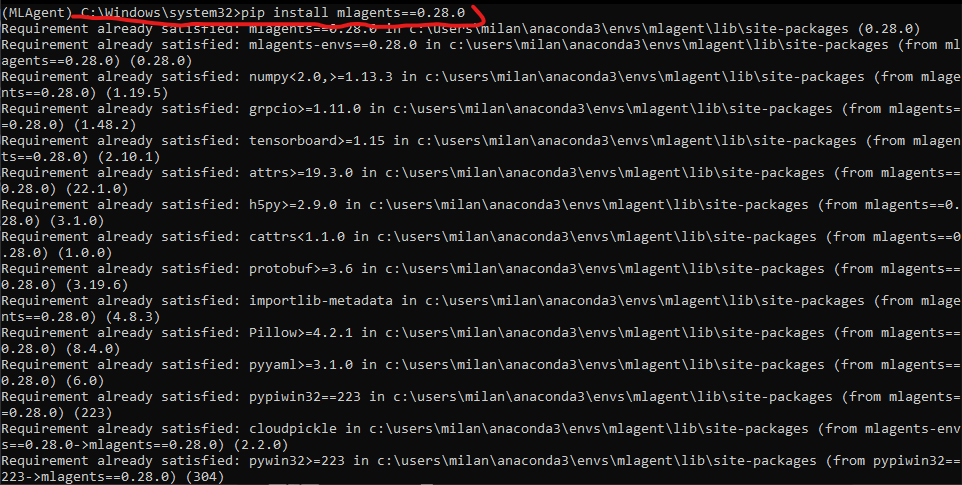

# АНАЛИЗ ДАННЫХ И ИСКУССТВЕННЫЙ ИНТЕЛЛЕКТ [in GameDev]
Отчет по лабораторной работе #3 выполнил(а):
- Файзулина Милана Мансуровна
- РИ000024
Отметка о выполнении заданий (заполняется студентом):

| Задание | Выполнение | Баллы |
| ------ | ------ | ------ |
| Задание 1 | * | 60 |
| Задание 2 | * | 20 |
| Задание 3 | * | 20 |

знак "*" - задание выполнено; знак "#" - задание не выполнено;

Работу проверили:
- к.т.н., доцент Денисов Д.В.
- к.э.н., доцент Панов М.А.
- ст. преп., Фадеев В.О.

Структура отчета

- Данные о работе: название работы, фио, группа, выполненные задания.
- Цель работы.
- Задание 1.
- Код реализации выполнения задания. Визуализация результатов выполнения (если применимо).
- Задание 2.
- Код реализации выполнения задания. Визуализация результатов выполнения (если применимо).
- Задание 3.
- Код реализации выполнения задания. Визуализация результатов выполнения (если применимо).
- Выводы.
- ✨Magic ✨

## Цель работы
Познакомиться с программными средствами для создания системы машинного обучения и ее интеграции в Unity.

## Задание 1
Реализовать систему машинного обучения в связке Python - Google-Sheets – Unity. 
Ход работы:
- Создать и активировать ML агент, установить необходимые библиотеки.

- Создать сферу, куб и плоскость в Unity, подключить к сфере c# скрипт и настроить компоненты.

- Запустить работу ML агента. Сделать 3, 9, 27 копий модели «Плоскость-Сфера-Куб», запустить симуляцию сцены и понаблюдать за результатом обучения модели. После завершения обучения проверить работу модели и сделать выводы.

Вывод: увеличение количества копий модели, выполняющих действие одновременно, помогает сделать обучение быстрее. Также было замечено, что изменение Mean Reward и Std of Reward может быть неравномерным, с временным ухудшением показателей. Возможно, для минимизации такого отклонения нужно отрегулировать параметры конфигурации нейронной сети.

## Задание 2
Подробно опишите каждую строку файла конфигурации нейронной сети, доступного в папке с файлами проекта. Самостоятельно найдите информацию о компонентах Decision Requester, Behavior Parameters, добавленных на сфере.
1. trainer_type: ppo
Proximal Policy Optimization (PPO) - один из относительно недавних алгоритмов глубоко обучения с подкреплением. PPO старается делать свои новые политики более похожими на старые с помощью более простых методов чем другие алгоритмы из его семейства. Это означает, что алгоритм исследует возможные новые действия на основе уже существующей политики. То, насколько случайными будут результаты следующего шага вычислений зависит от начальных условий и процедуры обучения. Обычно, в процессе обучения политика становится менее случайной, так как правила алгоритма подразумевают, что действия, которые приносили хорошие награды в прошлом, должны продолжать использоваться далее.
2. hyperparameters:
Гиперпараметры задаются до запуска алгоритма и используются для управления процессом обучения.
5. batch_size: 10

Определяет количество иинформации, собираемой в ходе одного шага в градиентном спуске. Связан с параметром buffer_size, всегда должен быть его долей.
7. buffer_size: 100

Определяет, сколько информации полученных в ходе выполнения действий будет сохранено в буфере перед тем, как на основе этих данных произойдет обучение или изменение модели. Чем выше этот показатель, тем стабильнее будет происходить обучение. 
8. learning_rate: 3.0e-4

Параметр задает величину каждого шага обновления градиентного спуска. Обычно это значение следует уменьшить, если обучение нестабильно, а вознаграждение не увеличивается последовательно.
10. beta: 5.0e-4

Параметр задает степень регуляризации энтропии, и определяет, какой будет степень случайности в обновленной политике. Чем выше этот параметр, тем больше случайных действий будет выполнять модель. При оптимальном подборе параметра энтропия будет уменьшаться с увеличением среднего вознаграждения. 
12. epsilon: 0.2

Соответствует допустимому порогу расхождения между старой и новой политиками при обновлении с градиентным спуском. Чем меньше показатель, тем более стабильно будет происходить обновление, но тем более медленно будет проходить процесс обучения.
14. lambd: 0.99

Используется при расчете Обобщенной Оценки Преимущества (GAE). Обозначает то, насколько агент полагается на текущую оценку значения при расчете обновленной ооценки значения. Чем выше значение, тем выше зависимость от фактических вознаграждений, полученных извне,что может привести к высокой дисперсии.
12. num_epoch: 3

Определяет количество проходов через буфер опыта во время градиентного спуска. Чем меньше параметр, тем стабильнее происходят обновления за счет более медленного обучения.
14. learning_rate_schedule: linear

Графики скорости обучения определяют, по какому графику будет проводиться корректировка скорости обучения путем снижения скорости обучения. Линейный график уменьшает скорость обучения на одну и ту же величину каждый цикл.
15. network_settings:
Параметры нейронной сети
16. normalize: false
К входным данным векторного наблюдения не будет применяться нормализация. Нормализация может быть полезна в случаях со сложными задачами непрерывного управления, но может быть вредна при более простых задачах дискретного управления.
18. hidden_units: 128
Соответствует количеству единиц в каждом полностью подключенном слое нейронной сети. Для простых задач, где правильным действием является простая комбинация входных данных наблюдения, это должно быть небольшим. Для задач, где действие представляет собой очень сложное взаимодействие между переменными наблюдения, это должно быть больше.
20. num_layers: 2
Определяет количество слоев нейронной сети. Для простых задач меньшее количество слоев, скорее всего, будет обучаться быстрее и эффективнее. Для более сложных задач управления может потребоваться больше уровней.
21. reward_signals:
Параметры вознаграждений
23. gamma: 0.99
Параметр задает степень значимости будущих вознаграждений. Чем выше значение, тем больше агент должен действовать в настоящем, чтобы подготовиться к вознаграждению в отдаленном будущем. 
20. strength: 1.0
22. max_steps: 500000
Параметр задает количество шагов моделирования (умноженных на частоту кадров), выполняемых в процессе обучения. Чем сложнее задача, тем выше должно быть это значение.
24. time_horizon: 64
Параметр соответствует количеству шагов опыта, которые необходимо собрать для каждого агента, прежде чем добавлять его в буфер опыта. Когда этот предел достигается до окончания эпизода, оценка стоимости используется для прогнозирования общего ожидаемого вознаграждения от текущего состояния агента. Это число должно быть достаточно большим, чтобы охватить все важное поведение в рамках последовательности действий агента.

## Задание 3
Доработайте сцену и обучите ML-Agent таким образом, чтобы шар перемещался между двумя кубами разного цвета. Кубы должны, как и в первом задании, случайно изменять координаты на плоскости. 

## Выводы
что такое игровой баланс и как системы машинного обучения могут быть использованы для того, чтобы его скорректировать.

| Plugin | README |
| ------ | ------ |
| Dropbox | [plugins/dropbox/README.md][PlDb] |
| GitHub | [plugins/github/README.md][PlGh] |
| Google Drive | [plugins/googledrive/README.md][PlGd] |
| OneDrive | [plugins/onedrive/README.md][PlOd] |
| Medium | [plugins/medium/README.md][PlMe] |
| Google Analytics | [plugins/googleanalytics/README.md][PlGa] |

## Powered by

**BigDigital Team: Denisov | Fadeev | Panov**
